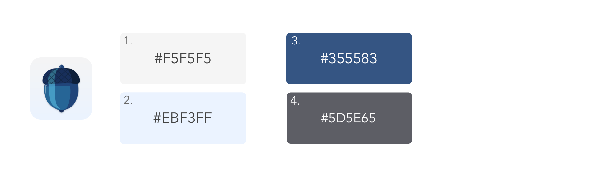

# Squirrel Away

*iOS application and website that aims to help users cache and manage an assortment of online resources from important links and forms to inspirational images and custom notes.*

[Pitch Deck Slides](https://docs.google.com/presentation/d/1ZklSnnp-zRMfFw25vopJZ020I-NSlppPIbStpQbayfs/edit?usp=sharing)
Check the [Squirrel Away](https://squirrel-env.herokuapp.com/) live link and check the [website repo here](https://github.com/AnniePawl/SPD1.3).

## Screen Casts

## App Icon

### The Team
**[Anna Pawl](https://github.com/AnniePawl)**\
&nbsp;&nbsp;&nbsp;&nbsp;&nbsp;&nbsp;**Roles:** Project Manager, Frontend Lead, UX and UI Designer\
&nbsp;&nbsp;&nbsp;&nbsp;&nbsp;&nbsp;**Technologies:** Node, Express, Handlebars, Adobe Illustrator, Adobe Xd
\
\
**[Rinni Swift](https://github.com/RinniSwift)**\
&nbsp;&nbsp;&nbsp;&nbsp;&nbsp;&nbsp;**Roles:** Lead iOS Developer, UX and UI Designer\
&nbsp;&nbsp;&nbsp;&nbsp;&nbsp;&nbsp;**Technologies:** Swift, Xcode, Adobe Xd
\
\
**[Kuan-Ying Fang](https://github.com/kfa408)**\
&nbsp;&nbsp;&nbsp;&nbsp;&nbsp;&nbsp;**Roles:** Backend Lead, Git Master\
&nbsp;&nbsp;&nbsp;&nbsp;&nbsp;&nbsp;**Technologies:** MongoDB, Node.js, Express
\
\
**[Jason Romulus](https://github.com/jasonromulus)**\
&nbsp;&nbsp;&nbsp;&nbsp;&nbsp;&nbsp;**Roles:** Backend Engineer\
&nbsp;&nbsp;&nbsp;&nbsp;&nbsp;&nbsp;**Technologies:** Node.js, AWS 

## Color Scheme

1. Background white color: #F5F5F5
2. Background light blue color: #EBF3FF
3. Main topic text color: #355583
4. Text color: #5D5E65

---
### Contact Me
**Rinni Swift**\
*iOS Developer, UI and UX designer*\
Check my [GitHub profile](https://github.com/RinniSwift)\
Connect with me on [LinkedIn](https://www.linkedin.com/in/rinni-swift-07b6b8169/)\
Check my [Portfolio](https://www.makeschool.com/portfolio/RinniSwift)